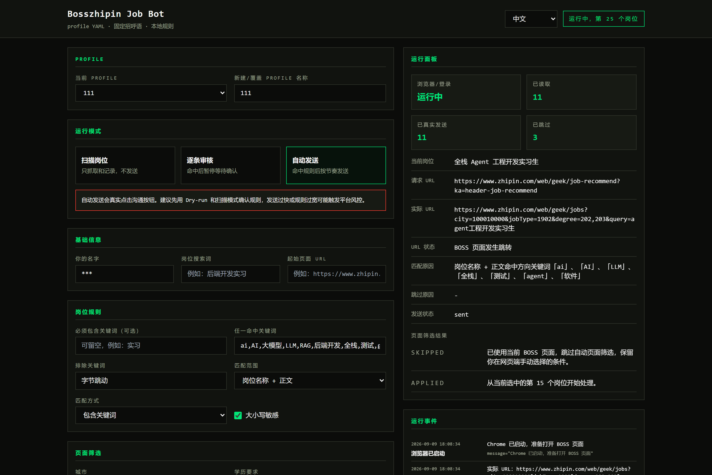
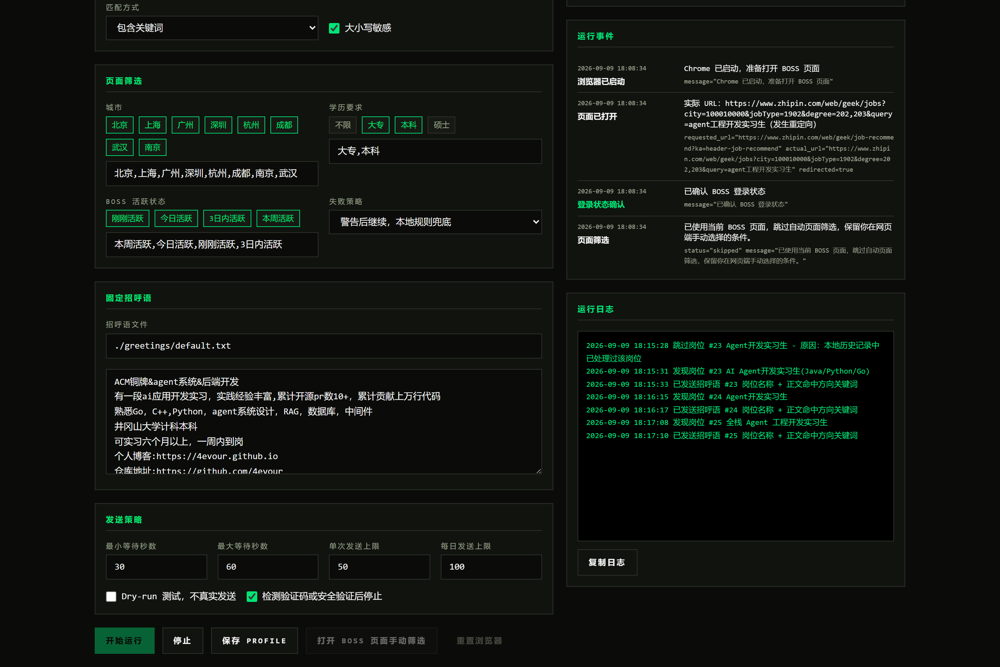

# Bosszhipin Job Bot

[中文](README.md) · [English](README_EN.md)

面向个人求职的 BOSS 直聘岗位筛选与固定招呼语沟通工具。0.2 版本开始，GUI 是主入口；CLI 保留给技术用户和自动化测试。

建议在发生招呼语之前，先在boss的web端进行一些条件的筛选

因为web的推流机制不会延续之前的app端，最开始给你推荐的岗位会跟你想要的岗位不够合适，一些筛选机制也没有app端的丰富

以及对方要简历记得及时回复，这个自动发送附件简历的功能还没做

本项目只做三件事：

- 打开 BOSS、复用独立 Chrome profile 登录态。
- 按本地关键词规则筛选岗位。
- 使用你自己填写的固定招呼语，在 `scan` / `review` / `auto` 模式下记录、审核或发送。

本项目不再提供 LLM 生成招呼语、简历解析、RAG、向量库或 provider 配置。你不需要配置任何 AI API key。

> 本仓库最初参考 [`longsizhuo/BossZhiPin_Job_Search`](https://github.com/longsizhuo/BossZhiPin_Job_Search) 的浏览器自动化思路，但 0.2 已收敛为自己的固定招呼语和本地规则工作流。
> 源项目的一些问题在该项目上面也得到了解决

## 界面预览

界面基于真实运行状态展示，姓名已脱敏。点击图片可查看原始尺寸。

[](docs/images/dashboard-runtime-overview-hires.png)

[](docs/images/dashboard-runtime-filters-and-logs-hires.png)

## 免责声明

- 本项目是免费、开源的个人求职辅助工具，按 [MIT 许可证](LICENSE) 提供。
- 使用浏览器自动化访问 BOSS 直聘可能违反其服务条款。是否使用、如何使用，以及由此产生的账号风险或其他后果，均由使用者自行承担。
- 请仅用于个人求职，不要高频群发、骚扰招聘者，或用于任何商业化用途。
- `auto` 模式有账号风控风险。建议先用 `scan` 和 `review`，确认规则稳定后再小批量运行。

## 快速开始

### 环境要求

- Python >= 3.11
- Chrome stable
- [uv](https://docs.astral.sh/uv/)
- Windows / macOS / Linux

### 安装

```bash
git clone https://github.com/4evour/Bosszhipin-job-bot.git
cd Bosszhipin-job-bot
uv sync
cp .env.example .env
```

### 启动 GUI

```bash
uv run python -m boss_zhipin.tauri
```

GUI 中配置：

- 运行模式：`scan`、`review`、`auto`
- 岗位搜索词和 BOSS 起始页 URL
- 可选的必须包含关键词，留空表示不限制
- 方向关键词，默认 `后端开发,ai`
- 固定招呼语
- 随机等待秒数、单次发送上限、每日发送上限
- 是否 dry-run、是否遇验证码停止

首次运行会打开独立 Chrome profile：`./chrome_profile/`。扫码登录一次后，cookie 会保存在这个目录里，后续运行通常不需要重复登录。

## 运行模式

| 模式 | 行为 | 适合场景 |
|---|---|---|
| `scan` | 只扫描和记录命中岗位，不发送 | 调规则、看岗位质量 |
| `review` | 命中后展示岗位详情和招呼语，你确认后发送 | 边审核边发送，降低误发 |
| `auto` | 命中后按随机等待节奏发送固定招呼语 | 规则稳定后的小批量运行 |

建议顺序：

1. 先用 `scan`，确认岗位命中是否符合预期。
2. 再用 `review`，逐条确认发送。
3. 最后才用 `auto`，并设置保守的随机等待和发送上限。

## CLI 用法

CLI 保留给高级用户和测试。推荐使用 profile：

```bash
# 后端开发实习
uv run main.py --profile backend-intern

# AI 应用 / 大模型实习
uv run main.py --profile ai-intern
```

内置 profile：

| 文件 | 作用 |
|---|---|
| `profiles/base.yml` | 默认规则、发送模式、随机等待、日志路径 |
| `profiles/backend-intern.yml` | 后端开发实习 |
| `profiles/ai-intern.yml` | AI 应用 / 大模型实习 |
| `profiles/guangzhou-backend.yml` | 广州后端开发实习 |
| `profiles/shenzhen-ai.yml` | 深圳 AI 应用实习 |

profile 支持继承。例如 `backend-intern.yml` 只写和 `base.yml` 不同的部分。

## Profile 配置

示例：

```yaml
extends: base.yml

search:
  query: 后端开发实习

filters:
  title:
    required:
      enabled: true
      scope: title
      match: contains
      case_sensitive: false
      keywords:
        - 实习

    any:
      enabled: true
      scope: title
      match: contains
      case_sensitive: false
      keywords:
        - 后端开发
        - ai

send:
  mode: review
  greeting_file: ./greetings/default.txt
  delay_min: 10
  delay_max: 60
  max_sent: 50
  daily_sent_limit: 80
  stop_on_captcha: true
```

`filters` 支持：

| 字段 | 可选值 |
|---|---|
| `scope` | `title` / `description` / `company` / `boss` / `location` / `all` |
| `match` | `contains` / `regex` / `exact` |
| `case_sensitive` | `true` / `false` |

匹配顺序固定为 `exclude -> required -> any`。默认建议只匹配 `title`，避免岗位详情里的页面噪声影响判断。

## 页面筛选

profile 中可以配置 BOSS 页面筛选：

```yaml
page_filters:
  strict: false
  city:
    enabled: true
    values: [广州, 深圳]
  education:
    enabled: true
    values: [本科]
  boss_active:
    enabled: true
    values: [刚刚活跃, 今日活跃]
```

页面筛选只是减少噪声，本地 `filters` 才是最终兜底。默认 `strict: false`，页面控件点不上时只记录 warning 并继续；如果你希望页面筛选失败就停止，改成 `strict: true`。

## `.env` 字段速查

完整模板见 [`.env.example`](.env.example)。常用字段：

| 字段 | 作用 |
|---|---|
| `BOSS_USR_NAME` | 你的名字，用于运行前校验和记录 |
| `BOSS_LABEL` | 岗位搜索词 |
| `BOSS_START_URL` | BOSS 起始页 URL，可粘贴你手动筛好的搜索页 |
| `BOSS_FIXED_GREETING` | 固定招呼语 |
| `BOSS_SCAN_ONLY` | `1` 表示扫描模式 |
| `BOSS_REVIEW_BEFORE_SEND` | `1` 表示逐条审核 |
| `BOSS_AUTO_SEND_FIXED_GREETING` | `1` 表示自动发送固定招呼语 |
| `BOSS_AUTO_TITLE_REQUIRED_TERMS` | 自动发送标题必需关键词 |
| `BOSS_AUTO_TITLE_KEYWORDS` | 自动发送标题方向关键词 |
| `BOSS_AUTO_SEND_DELAY_MIN` | 自动发送最小等待秒数 |
| `BOSS_AUTO_SEND_DELAY_MAX` | 自动发送最大等待秒数 |
| `BOSS_AUTO_SEND_MAX_SENT` | 单次运行发送上限 |
| `BOSS_AUTO_SEND_DAILY_LIMIT` | 每日发送上限 |
| `BOSS_STOP_ON_CAPTCHA` | 检测验证码或安全验证后停止 |
| `BOSS_SCAN_MAX_JOBS` | 扫描岗位上限 |
| `BOSS_CHROME_PROFILE` | Chrome profile 目录 |

如果 BOSS 一打开总是本地城市，可以先在浏览器里手动选城市和岗位，把最终 URL 填到 `BOSS_START_URL`。GUI 也提供这个输入框。

## 日志

默认日志文件：

| 文件 | 内容 |
|---|---|
| `logs/scan_matches.jsonl` | 扫描命中的岗位 |
| `logs/seen_jobs.jsonl` | 已看过的岗位 key |
| `logs/sent_jobs.jsonl` | scan / dry-run / 已发送记录 |
| `logs/skipped_jobs.jsonl` | 跳过原因 |
| `logs/letters.jsonl` | 固定招呼语校验和发送审计 |

## 常见问题

### 我不想自动发送，怎么测试？

GUI 勾选 `Dry-run 测试，不真实发送`，或在 `.env` 设置：

```bash
DRY_RUN=1
```

### 为什么没有 AI 生成招呼语？

0.2 的目标是可控、可解释、可复用。招呼语由用户自己填写，系统只负责筛选、审核、节流和发送。

### 怎么避免发送太快？

设置：

```bash
BOSS_AUTO_SEND_DELAY_MIN=10
BOSS_AUTO_SEND_DELAY_MAX=60
BOSS_AUTO_SEND_MAX_SENT=50
BOSS_AUTO_SEND_DAILY_LIMIT=80
```

`auto` 模式每次发送后会在最小值和最大值之间随机等待。

### 发送后跳到聊天页怎么办？

当前流程会在发送后尝试回到岗位列表；如果 BOSS 弹出“留在此页”，会自动点击并继续处理下一条。

## 项目结构

```text
.
├── main.py
├── profiles/
├── greetings/
├── tauri-ui/
├── src/boss_zhipin/
│   ├── cli.py
│   ├── config/
│   ├── website_oper/
│   ├── gui/
│   ├── audit/
│   └── tauri/
└── tests/
```

## 开发验证

```bash
uv run pytest -q
pnpm --dir tauri-ui build
```

## 致谢

感谢原参考项目和所有开源贡献者。本仓库从 0.2 开始专注于固定招呼语、本地规则和可视化运行台。
